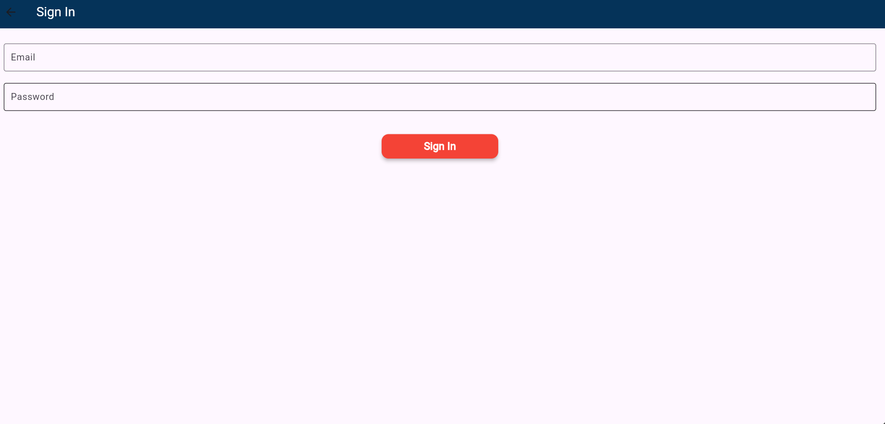
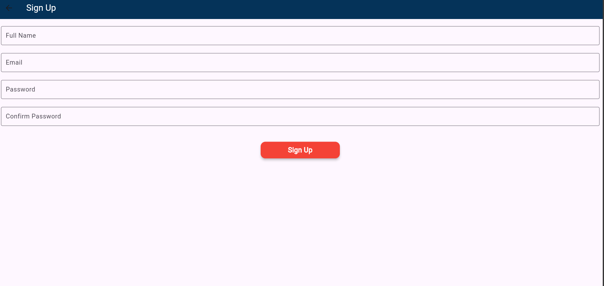
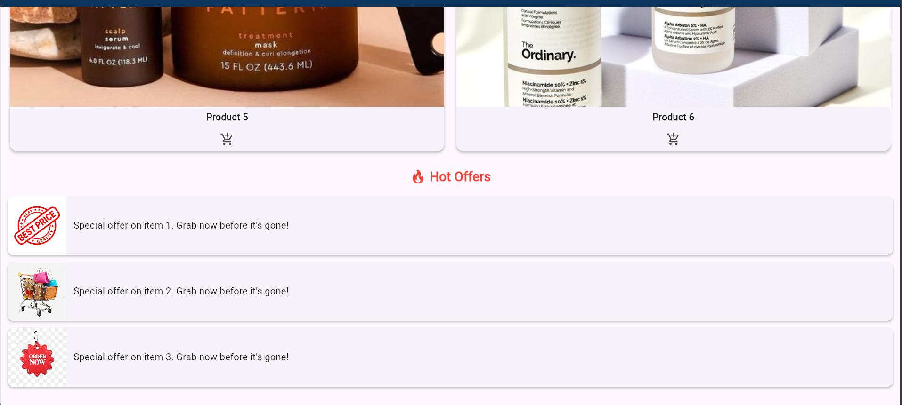
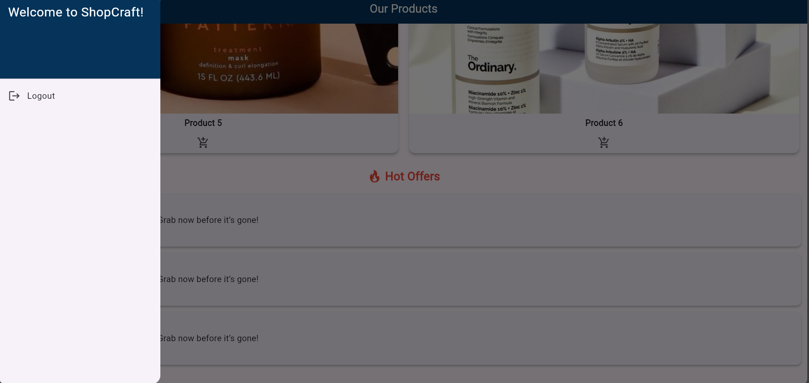

# 🛍️ Shopping Sprints App

## 📖 Overview
Shopping Sprints is a Flutter-based shopping app designed to provide users with a clean and modern UI to browse and shop efficiently.

## ✨ Features
- Multi-language support (English & Arabic)
- Clean shopping page layout
- Responsive design
- Organized widgets and localization
- Navigation between welcome and main shopping pages

## 🚀 Getting Started

### Prerequisites
- Flutter SDK installed
- Dart enabled
- Android Studio or VS Code

### Setup Instructions
1. Clone the repository:
```bash
git clone https://github.com/Jayan2003/ShoppingSprintsApp.git

## 🖼️ Screenshots

### 🏠 Welcome Page


### 🏠 Sign In Page

### 🏠 Sign Up Page

### 🛍️ Main Shopping Page






### 🌐 Localization Example

